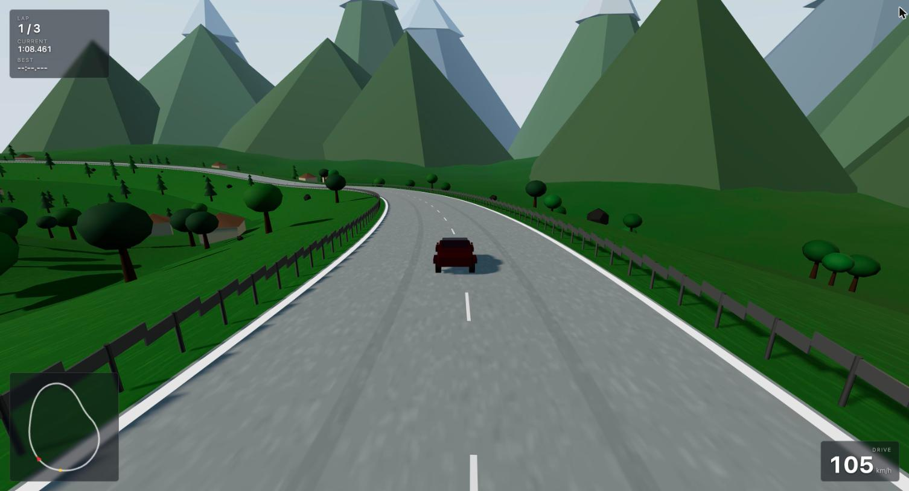

# Weissach GT

A Porsche-inspired 3D racing game that runs in the browser, inspired by *Need for Speed: Porsche Unleashed*. Three.js for rendering, cannon-es for physics, no external art assets — every mesh in the game is generated in code.



## Quick start

```bash
npm install
npm run dev
```

Then open <http://localhost:5173/>.

| Script | Does |
|--------|------|
| `npm run dev` | Vite dev server with hot reload |
| `npm run build` | Production build into `dist/` |
| `npm run preview` | Serve the production build |

There is no test suite or linter configured yet.

## Controls

| Key | Action |
|-----|--------|
| `W` / `↑` | Throttle |
| `S` / `↓` | Brake — then reverse once stopped |
| `A` `D` / `←` `→` | Steer |
| `Space` | Handbrake |
| `C` | Cycle camera (chase / hood / cockpit / side) |
| `R` | Respawn at the start line |

Brake and reverse share a key: `S` slows you while you're moving forward, and selects reverse once you're stopped. Throttle is symmetric — it brakes you out of reverse before pulling away.

## Tracks

Pick a track with the `?track=` query parameter, e.g. <http://localhost:5173/?track=portofino>.

| Id | Name | Length | Road | Character |
|----|------|--------|------|-----------|
| `alpenpass` | Alpenpass | 2191 m | 14 m | Swiss pass climbing 0→72 m, switchbacks, chalets |
| `cotedalbatre` | Côte d'Albâtre | 2579 m | 13 m | Normandy clifftop, sea on the outside, farmland inland |
| `portofino` | Portofino | 1925 m | 11 m | Tight harbourside streets, buildings against the barriers |

Defaults to `alpenpass`.

## How it works

The whole game lives under `src/game/`, driven by a single `Game` class that owns the Three.js scene, the cannon-es world, and a fixed-timestep loop (physics at 60 Hz, rendering at display rate).

| Module | Responsibility |
|--------|----------------|
| `Game.js` | Orchestrator — scene, physics world, loop, cameras, respawn |
| `Car.js` | `RaycastVehicle` wrapper plus procedural bodywork |
| `CarConfig.js` | Chassis/suspension tuning and the per-car stat table |
| `Track.js` | Builds a track: road, collision corridor, terrain, props, guardrails |
| `TrackBuilder.js` | Spline maths — road mesh, corridor, markings, start line |
| `Themes.js` | Everything scenic, per location |
| `Race.js` | Lap timing and checkpoints |
| `Hud.js` | Lap/speed readout and minimap |
| `Environment.js` | Sky, sun, mountains, clouds |
| `tracks/` | Track data — 3D waypoints, road width, theme |

A few decisions worth knowing before changing things:

- **Track waypoints are 3D.** `{x, y, z}`, where `y` is road-surface elevation.
- **One mesh is both the ground you see and the ground you drive on.** `TrackBuilder.buildCorridor()` sweeps a cross-section along the spline — asphalt at road height grading out to a drop-off at ±40 m — and returns geometry for the visible verge plus raw arrays for a `CANNON.Trimesh`. They can't drift apart because they come from the same data.
- **Guardrails are solid, and have to be boxes.** cannon-es has no Box-vs-Trimesh narrowphase, so walls can't be part of the corridor mesh. They also sit *above* where the wheel raycasts start, because `world.rayTest` accepts no collision filter — otherwise the suspension reads a barrier top as ground and the car climbs its own guardrail.
- **A lap is signed progress along the spline, not a line crossing.** Progress decrements when you reverse, so a lap only banks after a full circuit of forward travel.
- **Adding a location is a data change.** Write a theme in `Themes.js`, a waypoint list in `tracks/`, register it in `tracks/index.js`.

## Status

Phases 1 and 2 of [the implementation plan](docs/implementation-plan.md) are complete: core engine, car physics, cameras, the track system, three tracks, lap timing and the HUD.

Phase 3 (car models and handling) is next. The car is still placeholder geometry — it reads as a coloured box at any distance, and is the biggest remaining gap against the reference.

See [the plan](docs/implementation-plan.md) for per-task status and a list of known gaps.
